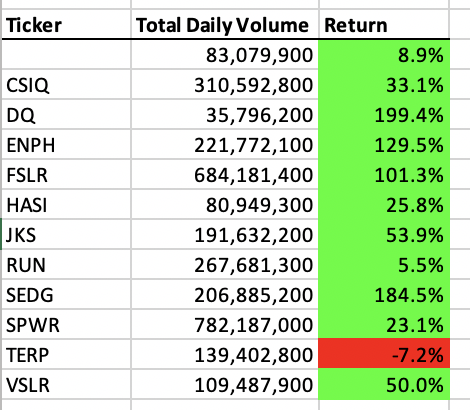
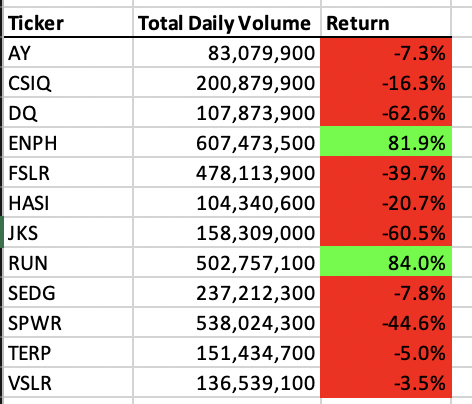
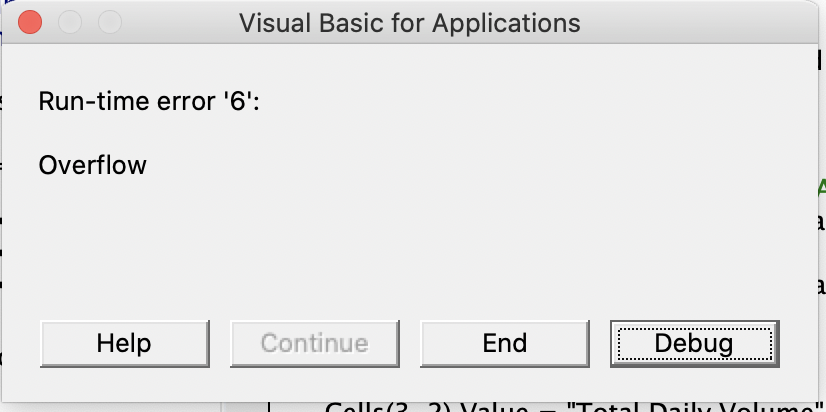
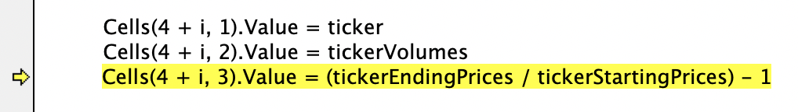

# Stock-analysis

## Background and Overview

Our friend Steve just gradated with a finance degree and wants help with creating a worksheet that can easily analyze the stocks from 2017 and 2018. He is wants this in part due to his parents desire to invest some money. Macros were written to create a table with formatting to highlight if each stock gained or loss money. Steve, duly impressed, then wanted to macro to be refactored to allow for a larger set of data to be analyzed. 

## Analysis of Results and Code 

### Analysis of Stocks 

If Steve's parents were to invest money, their best bet would to invest in ENPH and RUN stocks. These are the only two options that continued to gain money in both 2017 and 2018. They should also avoid investing in TERP since that option continued to lose money in both years. 

 

### Analysis of Code 

When writing the code, there was some issues. It is unknown if it was due to being poorly written or if the computer, and specifically Excel, was just not willing to comply. Aside from the usual challenges of the misspelling and not putting "end if" at the end of loops, a Run-Time error '6' : Overflow would pop up. According to the debugger it would specifically point to a line code, that according to TAs and fellow coders, appeared to be fine- or at least had no visible issues. This specifically occured for the AllStocksAnalysisRefactored code (seen below). 

So while the pre-refactored AllStocksAnalysis macro ran relatively quickly (~ 0.6 seconds), it can not be compared to the refactored coded in terms of speed. If there needs to be a pro and cons of list of macros it would looke like this: 

AllStocksAnalysis: Pros- it works, Con- none 

AllStocksAnalysisRefactored: Pros- none, Con- refuses to work 

The refactored code can be found here: [refactored code](https://github.com/arahogc/Stock-analysis/blob/main/Resources/All%20Analysis%20Refactored.rtf)

## Summary 

Invest wisely into ENPH and RUN stocks. Keep the original code as it is and do not refactor it. 
